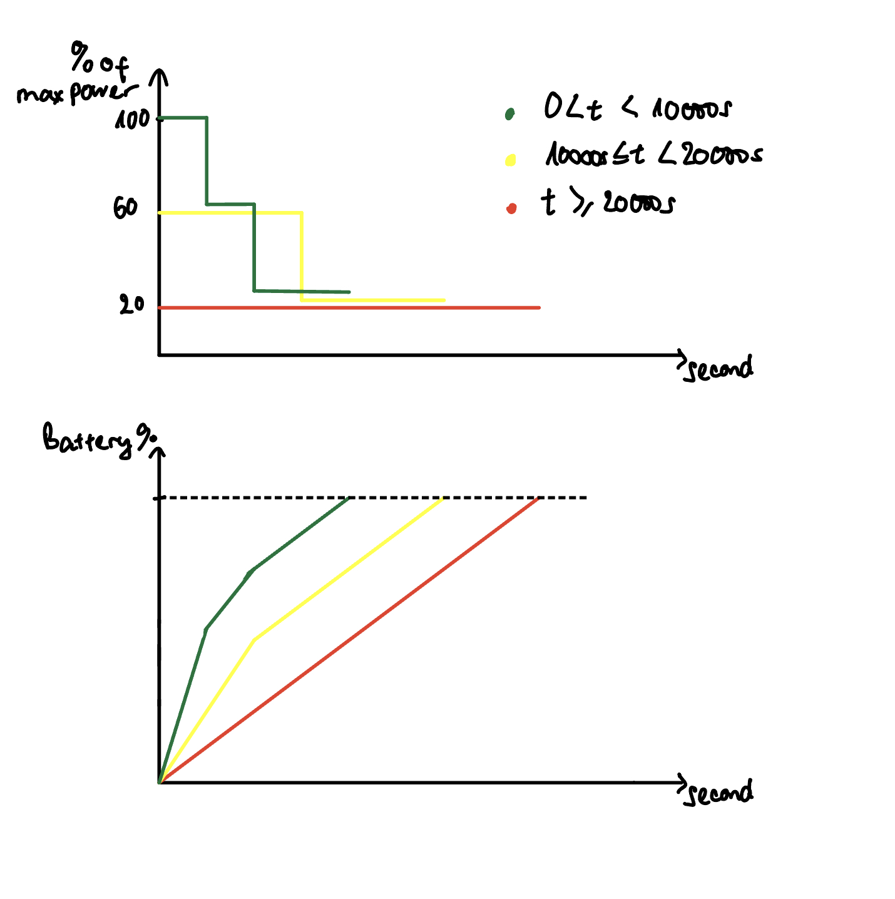

# Documentation

## File structure
```
station1/src/               --> Directory of one user client
├── components
│   ├── Clock.js            --> Real-time clock. Child component of App.js
│   ├── MainSource.js       --> Shows maximum power allowed in one client. The power
│   │                           remaining will be updated automatically.
│   │                           Child component of StationContainer.js
│   └── Station.js          --> Main component of each station.
│   │                           Child component of StationContainer.js
├── containers
│   ├── App.js              --> Runs the user client.
│   ├── ChartData.js        --> Chart information of one user client.
│   │                           Child component of StationContainer.js
│   └── StationContainer.js --> Contains all stations information of one user client.
│   │                           Child component of App.js
├── App.css                 --> CSS file for displaying the client
├── db.json                 --> Database regarding the stations
├── index.js                --> Runs the client.

backend/
├── index.html              --> Displaying the chart updates
├── index.js                --> Running the backend server
```
## Getting started

station1: `npm install` & `npm start`
backend: `npm install` & `npm run nodemon` and on another cmd line: `http-server --cors`

## How to operate

The client runs at the address `localhost:3000`, where the user can set when the charging will be completed. After pressing the start button, the current power used by the station is sent to the server, located at `localhost:8888/activeStations`. Such data will be sent to the monitoring client `localhost:8080` and displayed in a pie chart.

## The algorithm

The power is distributed depending on the charging duration set by the user. The graphs below indicate such distribution and the corresponding battery percentage increase.


